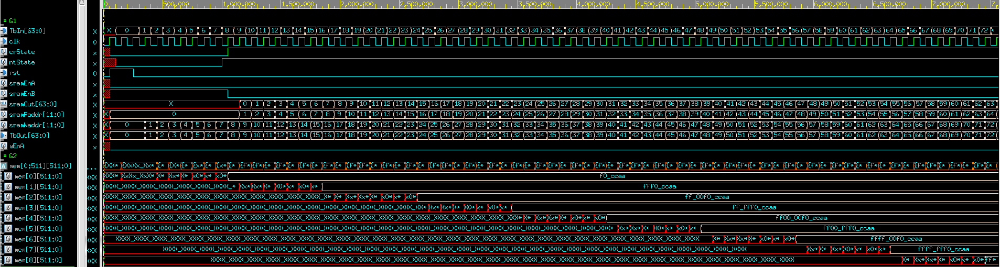

# Dual-port Sram test

This is a simple test of dual port sram which generated by memory compiler.

## Notes

- Each data entry is 64 bits.
- This SRAM supports simultaneous read and write operations. In the program, the A port is used for writing the values obtained from the tb, while the B port is used to read the values from SRAM memory.
- Because of memory size is mem[0:511][511:0], if simultaneous read and write operations are desired, the addresses for read and write operations must differ by 8.  
  Otherwise, the read operation will take priority over the write operation.

## Instruction

```
ncverilog tb.v memTest.v sram_dp_4096x64.v +access+r +notimingchecks
```

## Simulation result


