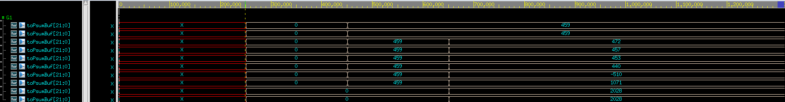

# PE array test

## Description
This folder aims to verify PE array part function in hardware accelerator.

## Notes

- The file "quantize_per_tensor.xlsx" contains a segment of data that has undergone quantization in the first layer of neural network.
- Tb provide a set of feature maps and a kernel as inputs to verify the functionality of the system.
- The synthesized area size using the constraints PE_array.sdc is 313,823.
- The output need to observe is the result obtained after the final accumulation of the Adder, which is stored in toPsumBuf.

## Instruction

```
ncverilog tb.v PE_array_syn.v tsmc13_neg.v +define+FSDB+SDF +access+r
```

## Simulation result


